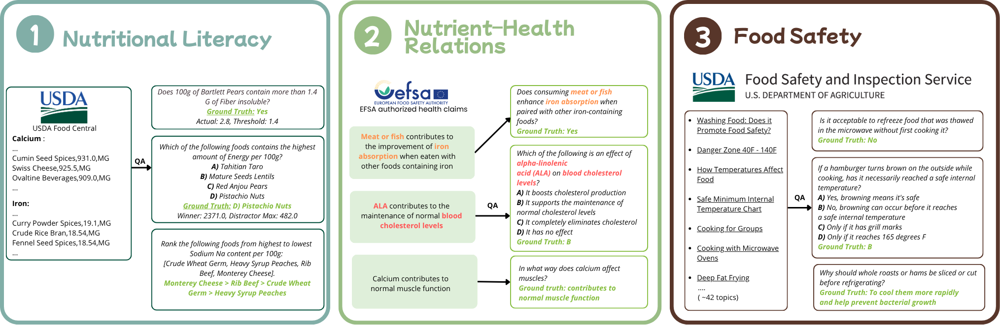

# FoodVitals: A Diagnostic Benchmark for LLMs on Nutritional Literacy, Nutrient-Health Relations, and Food Safety

## 🎯 Motivation and Intended Use
Large Language Models (LLMs) are increasingly deployed in high-stakes, food-facing roles such as nutrition counselling, dietary planning, cooking assistants, or food-safety chatbots. **FoodVitals** provides a unified diagnostic benchmark for evaluating the foundational food knowledge of these models. 

**Intended diagnostic use:** FoodVitals is intended as a pre- and post-deployment auditing tool. Practitioners can run the released harness on a candidate or fine-tuned model to locate failure modes (e.g., the magnitude-reasoning gap or format-induced safety regression) before exposing end-users to them, and to re-run the same audit after fine-tuning to verify that domain adaptation has not introduced new high-stakes errors.

---

## 🔍 Main Findings
Evaluating six instruction-tuned LLMs using FoodVitals reveals two consistent patterns:
1. **Magnitude-Reasoning Gap (Nutritional Literacy):** Models that correctly identify the highest-nutrient food in a multiple-choice setting cannot reliably rank or threshold-check the same nutrients. This exposes a gap between associative recall and quantitative reasoning.
2. **Format-Induced Regression (Food Safety):** Food-safety performance varies substantially across answer formats (MCQ, Y/N, Short Answer) even when all formats draw from the same regulatory topic set. This means a high score in one format does not reflect uniform competence across that topic area, motivating the need for multi-format auditing.

---

## 📂 Data Availability & Setup

The full dataset and auxiliary files for FoodVitals are hosted on Figshare: **[10.6084/m9.figshare.32455959](https://doi.org/10.6084/m9.figshare.32455959)**. 

To run the evaluation, you must download specific files from the link above and place them into the corresponding folders in this repository. See the detailed instructions below for each aspect.

---

## 🏗️ Repository Structure & Usage Guide

This repository is organized into distinct folders corresponding to the aspects of food knowledge described in our paper.

### 🥦 1. Nutritional Literacy (`a1_nutritional_literacy`)
This aspect tests the model's ability to recall nutrient density and rank foods based on nutritional content, grounded in USDA FoodData Central.

**Setup Instructions:**
* Download the `nutrient_data` folder (contains raw files with food names and nutrient density lists used to build the QA).
* Download `a1_nutritional_literacy_qa.csv` (the final QA benchmark dataset).
* Place both the `nutrient_data` folder and `a1_nutritional_literacy_qa.csv` inside `a1_nutritional_literacy/`.

**Code Usage:**
* **Inference:** Use `infer_qwen.py`, `infer_flan.py`, or `infer_llama.py` to generate answers. To switch model sizes, modify the `MODEL_ID` variable inside the script.
* **Evaluation:** Use `eval_qwen.py`, `eval_flan.py`, or `eval_llama.py`. These scripts contain the cleaning logic and metric calculations.
* **Robustness:** `shuffle_mc.ipynb` is provided for shuffling Multiple Choice Questions to ensure anti-bias evaluation.

### 🏥 2. Nutrient-Health Relations (`a2_functional_health`)
Evaluates the understanding of health claims based on the EFSA Food Health Claims Knowledge Graph.

**Setup Instructions:**
* Download `a2_health-nutrient_qa.csv` (the final QA dataset).
* Place it inside `a2_functional_health/`.

**Code Usage:**
* **Generation Logic:** `gpt_prompt.py` contains the logic used to create the dataset.
* **Inference:** Run `infer_health_qwen.py`, `infer_health_llama.py`, or `infer_health_flan.py`.
* **Evaluation:** Run `evaluate_health.py` after inference to compute metrics.
* **Robustness:** `shuffle_mc.py` handles MCQ shuffling.

### ⚠️ 3. Food Safety (`a3_food_safety`)
Assesses adherence to food safety guidelines using a dataset created via GPT generation and manual filtering, grounded in USDA FSIS guidelines.

**Setup Instructions:**
* Download `a3_food_safety.jsonl` (the final QA dataset).
* Place it inside `a3_food_safety/`.

**Code Usage:**
* **Inference:** Run `infer_flan.py`, `infer_llama.py`, or `infer_qwen.py`. Ensure the `a3_food_safety.jsonl` file is present.
* **Generation:** `gpt_qa.py` contains the code used to generate the initial QA pairs before manual filtering.

---

## ⚖️ Availability, FAIR Compliance, and Ethics

FoodVitals, its three construction pipelines, and the evaluation harness are publicly released at `github.com/niluminous/food_eval`.

The release follows FAIR-aligned practices~\cite{wilkinson2016fair}:
items are \emph{Findable} via a persistent Digital Object Identifier (DOI) and 
indexed repository metadata; \emph{Accessible} over HTTPS via the open 
repository platform with no authentication requirements; \emph{Interoperable} 
through the unified typed schema across CSV and JSONL formats as described in 
\S\ref{sec:schema}; and \emph{Reusable} via the included Datasheet for 
Datasets~\cite{gebru2021datasheets}, open-source construction pipelines, 
and comprehensive upstream provenance manifests detailing the source mappings. 
All upstream sources (USDA FoodData Central~\cite{usda_fdc}, USDA FSIS~\cite{usda_fsis}, 
and the EFSA-derived Health Claims KG~\cite{celebi2024kg}) permit 
redistribution for research under their original terms.

**Ethics:** FoodVitals is a diagnostic benchmark and not a substitute for clinical, dietary, or food-safety advice, as stated in the datasheet. The current benchmark is grounded primarily in Western regulatory sources (USDA/EFSA). Future work will extend coverage to non-Western regulatory frameworks.